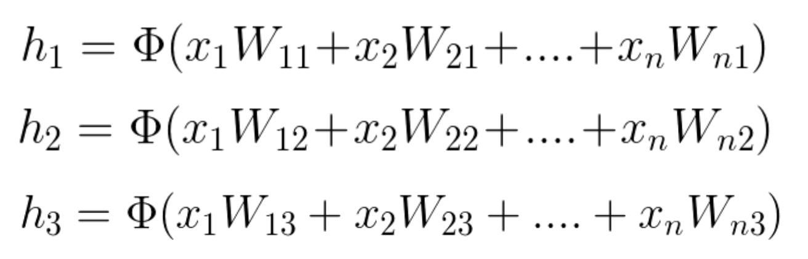
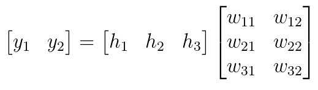

we've been looking at convolutional neural networks and models that allows us to analyze the spatial information in a given input image. CNN's excel in tasks that rely on finding spatial and visible patterns in training data.These networks give us a way to incorporate memory into our neural networks, and will be critical in analyzing sequential data. RNN's are most often associated with text processing and text generation because of the way sentences are structured as a sequence of words, but they are also useful in a number of computer vision applications, as well!

https://video.udacity-data.com/topher/2018/May/5af0e03b_video-classification/video-classification.pdf

RNNs have a key flaw, as capturing relationships that span more than 8 or 10 steps back is practically impossible. This flaw stems from the "vanishing gradient" problem in which the contribution of information decays geometrically over time.

What does this mean?

As you may recall, while training our network we use backpropagation. In the backpropagation process we adjust our weight matrices with the use of a gradient. In the process, gradients are calculated by continuous multiplications of derivatives. The value of these derivatives may be so small, that these continuous multiplications may cause the gradient to practically "vanish".

LSTM is one option to overcome the Vanishing Gradient problem in RNNs.

Please use these resources if you would like to read more about the Vanishing Gradient problem or understand further the concept of a Geometric Series and how its values may exponentially decrease.

## Why do we need RNNS?
* RNNs are used for time series analysis.
* When you need to make a prediction based on previous data, not only the current data. They make use of sequential information.
* Example :
  **Stock Price Prediction**.
  **Text Generation**

**A RNN is multiple copy of the same network that receives the inputs at different times as well as it's previous hidden state**.

### Feedforward Neural Network - A Reminder

**Training**

and

**Evaluation**.

During the training phase, we take the data set (also called the training set), which includes many pairs of inputs and their corresponding targets (outputs). Our goal is to find a set of weights that would best map the inputs to the desired outputs. In the evaluation phase, we use the network that was created in the training phase, apply our new inputs and expect to obtain the desired outputs.

The training phase will include two steps:

**Feedforward**

and

**Backpropagation**

We will repeat these steps as many times as we need until we decide that our system has reached the best set of weights, giving us the best possible outputs.

## Feedforward

Assuming that we have a single hidden layer, we will need two steps in our calculations. The first will be calculating the value of the hidden states and the latter will be calculating the value of the outputs.

Using vector by matrix multiplication, we can look at this computation the following way:

After finding h', we need an activation function Φ(xW1) to finalize the computation of the hidden layer's values. This activation function can be a Hyperbolic Tangent, a Sigmoid or a ReLU function. We can use the following two equations to express the final hidden vector.
Since Wij represents the weight component in the weight matrix, connecting neuron i from the input to neuron j in the hidden layer, we can also write these calculations in the following way: (notice that in this example we have n inputs and only 3 hidden neurons)

The process of calculating the output vector is mathematically similar to that of calculating the vector of the hidden layer. We use, again, a vector by matrix multiplication, which can be followed by an activation function. The vector is the newly calculated hidden layer and the matrix is the one connecting the hidden layer to the output.
Essentially, each new layer in an neural network is calculated by a vector by matrix multiplication, where the vector represents the inputs to the new layer and the matrix is the one connecting these new inputs to the next layer.

The two error functions that are most commonly used are the Mean Squared Error (MSE) (usually used in regression problems) and the cross entropy (usually used in classification problems).

http://tutorial.math.lamar.edu/pdf/Common_Derivatives_Integrals.pdf

## Backpropagation Theory
In the backpropagation process we minimize the network error slightly with each iteration, by adjusting the weights.
